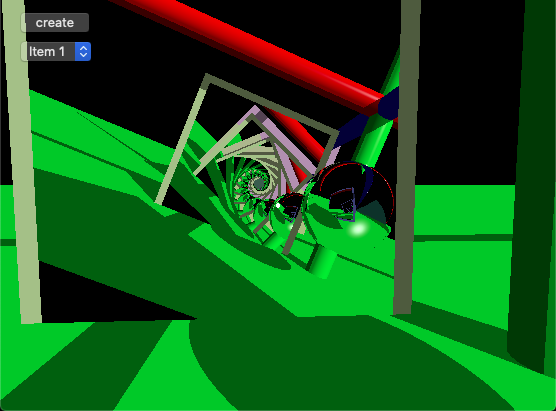
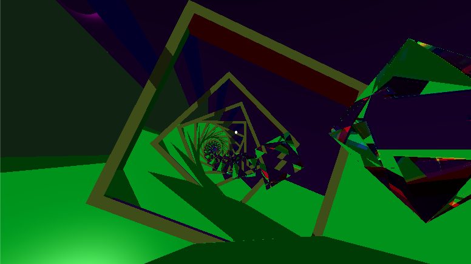
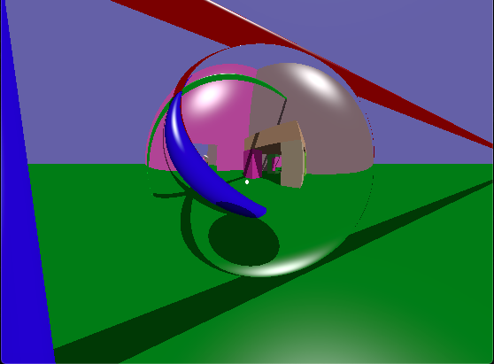
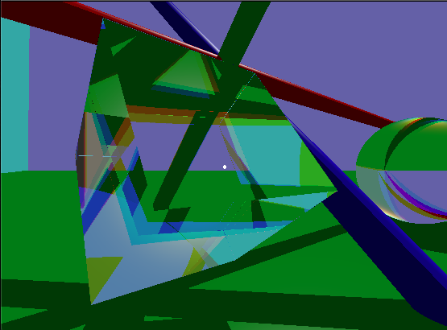
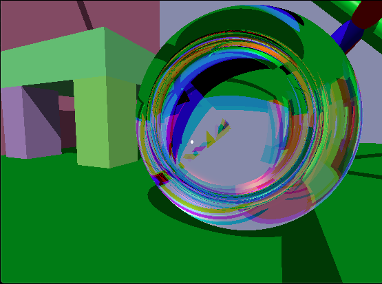

# Ray Traced Game Engine

This is a real-time ray-tracing game engine for MacOS.

YouTube Video: https://www.youtube.com/watch?v=6tEt2SM2F54

## features

* Reflection and Total Internal Reflection
* Refraction where the refractive index depends on the wavelength
* Portals
* A variety of primative geometric shapes including:
  * Sphere
  * Plane
  * Cylinder
  * Cube
  * Capped Cylinder
  * Cone 
  * Triangle

Portals facing eachother: \
 \
 \
Mirror sphere: \
 \
Cubic prism: \
 \
A sphere can be warped into a lens: \
 \

